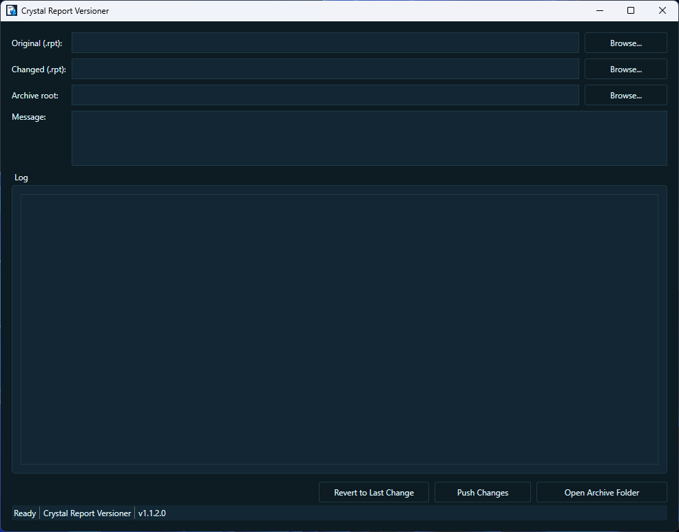

# Crystal Report Versioner – Diff, Archive, and Revert SAP Crystal Reports (.rpt) on Windows

A lightweight Windows WPF tool for versioning SAP Crystal Reports. Compare and archive changes to `.rpt` files, generate human-readable diffs, and safely revert to previous versions. Built for .NET Framework4.8.

- Works offline on local `.rpt` files
- Creates timestamped archives with HTML reports and metadata
- Optional deep analysis when the SAP Crystal Reports runtime is available

## Table of contents
- Why this tool
- Features
- Requirements and prerequisites
- Install / Build
- Quick start
- What gets generated
- Troubleshooting / FAQ
- Keywords and GitHub topics

## Why this tool
Crystal Reports often live on file shares without proper version control. This app gives you a fast, GUI-based workflow to diff two report versions, archive the result, and revert when needed—without introducing a full VCS or scripting.

## Features
- Push Changes (archive + replace):
 - Diffs Original vs Changed `.rpt`
 - Saves version under `archive/<reportName>/vyyyyMMdd-HHmmss/`
 - Generates `changes.html` (summary) and `metadata.json`
 - Produces a zip artifact and replaces the Original with the Changed file
 - Cleans up duplicate Changed files if both were in the same folder
- Revert to Last Change: restore the previously archived Original
- Master changelog per report: `ChangeLog-<reportName>.html` with links to zips
- Optional Crystal-level analysis (when SAP runtime present):
 - Record Selection Formula
 - Formula fields / Parameter fields
 - Table list changes
- Dark, minimal WPF UI for Windows

## Requirements and prerequisites
- Windows with .NET Framework4.8
- Optional: SAP Crystal Reports runtime (CRRuntime_64bit_13_0_xx) to enable deep Crystal analysis. Without it, the app still performs binary diffs and archiving.

## Install / Build
- Build from source:
 - Open the solution in Visual Studio2019/2022 (with .NET Framework4.8 targeting pack)
 - Restore dependencies and Build
 - Run the `ironmanx-04-2` WPF app
- Runtime branding icon is included; the app window and exe show the same icon.

## Quick start
1) Select Original `.rpt` and Changed `.rpt`
2) Pick Archive root (defaults to `<original directory>\archive`)
3) Enter a message (optional)
4) Click Push Changes
5) To undo: select the Original path and click Revert to Last Change

## What gets generated
Per push:
- Zip: `<archive root>/<reportName>/<reportName>-<timestamp>.zip`
- Version folder (pre-zip): `v<timestamp>/` containing:
 - `changes.html` (diff summary)
 - `metadata.json` (file hashes, sizes, diff stats, analysis mode)
- Master changelog updated at `<archive root>/<reportName>/ChangeLog-<reportName>.html`

## Troubleshooting / FAQ
- No SAP Crystal runtime installed
 - The app still works; Crystal-level analysis is skipped. Binary diff and archive are produced.
- Can’t find or load the window icon
 - The icon is copied to the output `resources/` and set at runtime. Ensure `resources/icon.ico` exists in the project.
- Where can I see the app version?
 - The version is shown in the footer (status bar) as `v<version>` for easy screenshots when reporting issues.

## Keywords and GitHub topics
Use these topics on GitHub to help others discover this repo:
- `crystal-reports`, `sap-crystal-reports`, `rpt`, `report-diff`, `diff-tool`, `archive`, `versioning`, `wpf`, `.net-framework-4.8`, `windows`
- Useful phrases: "Crystal Reports diff", "compare .rpt files", "archive Crystal Reports", "revert .rpt", "WPF report diff", "SAP Crystal runtime"